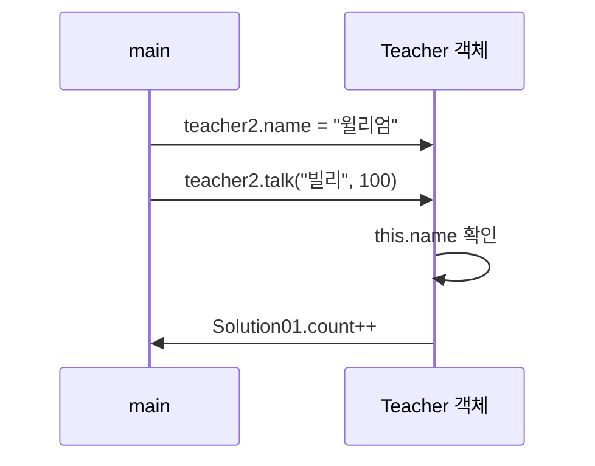

# Solution01 핵심 정리

## 초심자용

| 개념 | 이 코드에서 보이는 점 |
|---|---|
| `public class Solution01` | 파일 이름과 클래스 이름이 맞아야 함 |
| `Teacher teacher` | 참조 변수는 객체를 가리킴 |
| `teacher = null` | 연결이 없으면 `NullPointerException` 위험 |
| `new Teacher()` | 힙에 객체 생성 |
| 필드 기본값 | 값이 없으면 기본값이 출력됨 |
| `teacher2 = teacher` | 같은 객체를 같이 가리킴 |
| `count` | `static`이라 클래스 단위로 공유됨 |

```mermaid
flowchart LR
  A[teacher 변수] --> B[new Teacher()]
  B --> C[힙의 Teacher 객체]
  C --> D[teacher2 = teacher]
  D --> E[같은 객체 참조]
```

## 주니어/신입 면접용

| 질문 포인트 | 답변 키워드 |
|---|---|
| `teacher2.name = "윌리엄"` 후 `teacher.name`이 바뀌는 이유 | 같은 객체를 참조하기 때문 |
| `this.name` | 메서드 매개변수 `name`과 필드를 구분 |
| `Teacher.count`, `Solution01.count` | `static` 필드는 클래스에 속함 |
| 지역변수 `count`와 `static count` | 스코프가 다름 |



